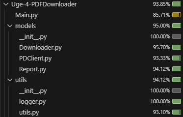

# Test Coverage

The test covers most of the codebase, however it could go through a few more test cases with regards to expections that might happen during download.

# Testing issues
The module Append to CSV is working correctly, only for testing purposes the row.values() and data.values() has been wrapped in list(). This is due to the nature of the output of data.values being an object meaning it isn't equal to another version of it even if it has the same content. 

The behaviour of the pdf report validation was not as expected. Therefore these tests are in most cases failing.

# Improvement points
The main improvement point would be the pdf report validation (in other words the url validation). This would need to be reworked to proper validate urls, as even empty strings are currently let through as a validated url.